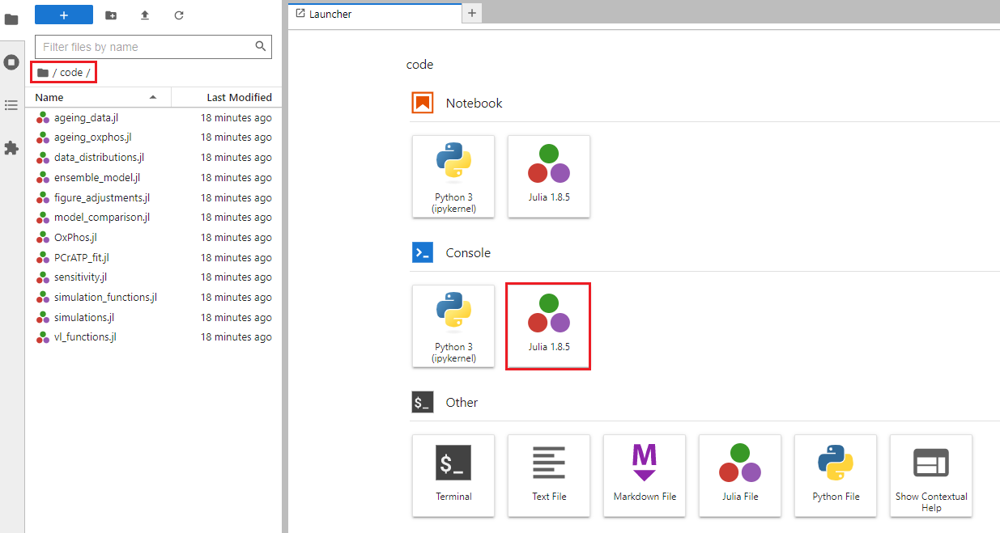

# Supplementary code for oxidative phosphorylation model

## Scripts
This repository contains the Julia code required to run the bond graph model in the study *The Human Cardiac “Age-OME”: Age-specific changes in myocardial molecular expression*. The code is included in the `code` folder, and the following files will generate the results included in the manuscript:
- `ageing_oxphos.jl` will generate results for Figure 6 in the main text
- `ensemble_model.jl` will generate Figure S of the Supplementary Material. Note that simulation results can be preloaded by downloading `ensemble_solutions.zip` from the releases, and extracting the contents into the `output/ensemble_simulations` folder.
- `PCrATPfit.jl` will generate Figure R of the Supplementary Material
- `sensitivity.jl` will generate Table 4 in the Supplementary Material

Note that all code needs to be run in the `code` directory.

## Instructions for running code
The code can be run either directly through Julia or by using a Docker container. Instructions are given for both approaches below.

### Julia installation
1. Install Julia (https://julialang.org/downloads/) and Git (https://git-scm.com/downloads)
2. Clone this repository locally by running the following in the terminal: `git clone https://github.com/mic-pan/ageing_heart_oxphos`
3. Start Julia: `julia`
4. Press the `]` key to enter the package manager
5. Activate the environment: `activate ageing_heart_oxphos`
6. Install the required packages: `instantiate`
7. Exit the package manager by pressing the backspace key
8. Change into the code directory: `cd("ageing_heart_oxphos/code")`
9. The scripts can be run by using the command `include("script_name.jl")`

### Docker installation
1. Install Docker (https://www.docker.com) and Git (https://git-scm.com/downloads)
2. Install repo2docker (https://repo2docker.readthedocs.io/en/latest/install.html).
  - Windows users will need to install repo2docker through Windows Subsystem for Linux (https://learn.microsoft.com/en-us/windows/wsl/install). Note that WSL2 is required, and users will need to enable Docker integration through the settings (https://learn.microsoft.com/en-us/windows/wsl/tutorials/wsl-containers).
3. Create the Docker container by running the following in the terminal: `jupyter-repo2docker https://github.com/mic-pan/ageing_heart_oxphos`
4. The scripts can be run through the Jupyter notebook interface. See below for details on opening the console. Scripts can be run using the command `include("script_name.jl")`.

